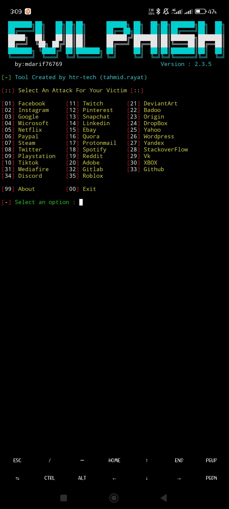
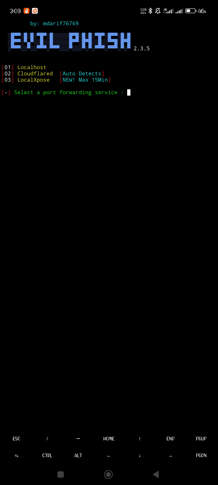
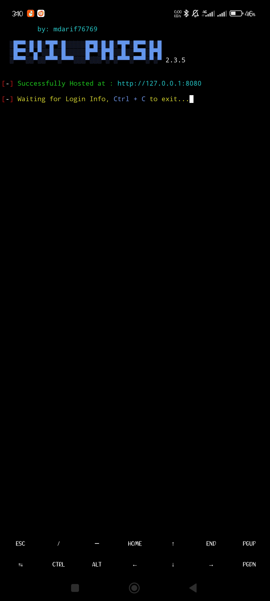
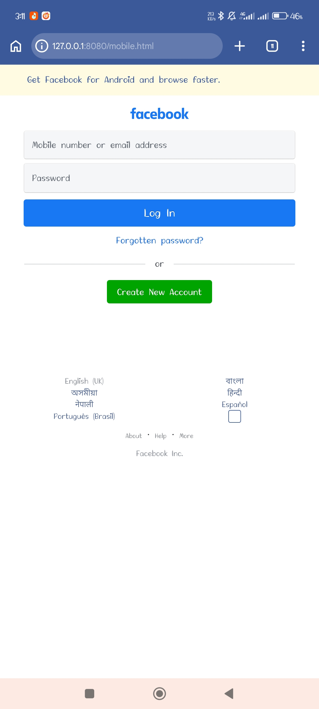
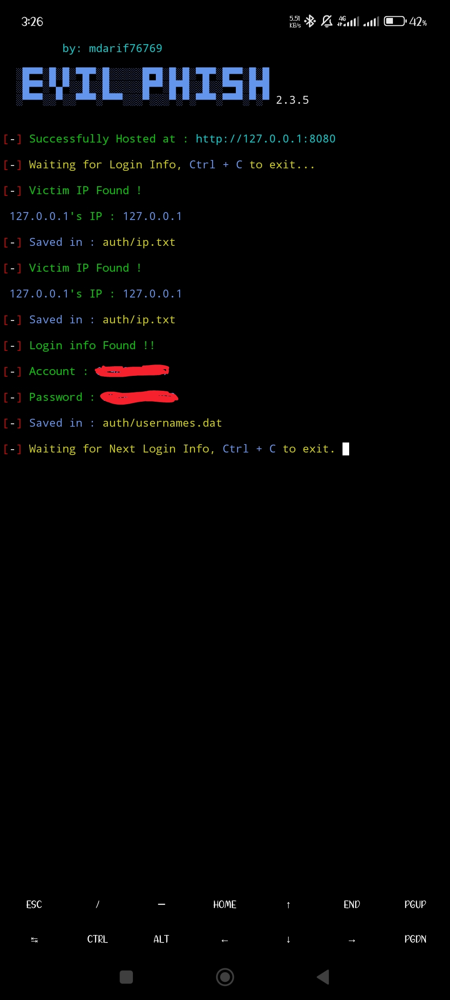

<!-- Evil-Phisher -->

<p align="center">
  
</p>

<p align="center">
  
  
  
  
  
</p>

<p align="center">
  
  
  
  
  </a>
</p>

<p align="center"><b>A beginners friendly, Automated phishing tool with 30+ templates.</b></p>

##

<h3><p align="center">Disclaimer</p></h3>

<i>Any actions and or activities related to <b>Zphisher</b> is solely your responsibility. The misuse of this toolkit can result in <b>criminal charges</b> brought against the persons in question. <b>The contributors will not be held responsible</b> in the event any criminal charges be brought against any individuals misusing this toolkit to break the law.

<b>This toolkit contains materials that can be potentially damaging or dangerous for social media</b>. Refer to the laws in your province/country before accessing, using,or in any other way utilizing this in a wrong way.

<b>This Tool is made for educational purposes only</b>. Do not attempt to violate the law with anything contained here. <b>If this is your intention, then Get the hell out of here</b>!

It only demonstrates "how phishing works". <b>You shall not misuse the information to gain unauthorized access to someones social media</b>. However you may try out this at your own risk.</i>

##

### Features

- Latest and updated login pages.
- Beginners friendly
- Multiple tunneling options
  - Localhost
  - Cloudflared
  - LocalXpose
- Mask URL support 
- Docker support

##

### Installation

- Just, Clone this repository -
  ```
  git clone --depth=1 https://github.com/htr-tech/Evil-Phisher.git
  ```

- Now go to cloned directory and run `Evil-Phisher.sh` -
  ```
  $ cd Evil-Phisher
  $ bash Evil_Phisher.sh
  ```

- On first launch, It'll install the dependencies and that's it. ***Evil-Phisher*** is installed.

##

### Installation (Termux)
You can easily install Evil-Phisher in Termux by using tur-repo
```
$ pkg install tur-repo
$ pkg install zphisher
$ zphisher
```
### A Note : 
***Termux discourages hacking***





##

<p align="left">
  <a href="https://shell.cloud.google.com/cloudshell/open?cloudshell_git_repo=https://github.com/mdarif76769/Evil-Phisher.git&tutorial=README.md" target="_blank"></a>
</p>

##

### Installation via ".deb" file

- Download `.deb` files from the [**Latest Release**](https://github.com/mdarif76769/Evil-Phisher/releases/latest)
- If you are using ***termux*** then download the `*_termux.deb`

- Install the `.deb` file by executing
  ```
  apt install <your path to deb file>
  ```
  Or
  ```
  $ dpkg -i <your path to deb file>
  $ apt install -f
  ```

##

### Run on Docker

- Docker Image Mirror:
  - **DockerHub** : 
    ```
    docker pull htrtech/Evil-Phisher
    ```
  - **GHCR** : 
    ```
    docker pull ghcr.io/mdarif76769/Evil-Phisher:latest
    ```

- By using the wrapper script [**run-docker.sh**](https://raw.githubusercontent.com/mdarif76769/Evil-Phisher/master/run-docker.sh)

  ```
  $ curl -LO https://raw.githubusercontent.com/mdarif76769/Evil-Phisher/master/run-docker.sh
  $ bash run-docker.sh
  ```
- Temporary Container

  ```
  docker run --rm -ti htrtech/Evil-Phisher
  ```
  - Remember to mount the `auth` directory.
